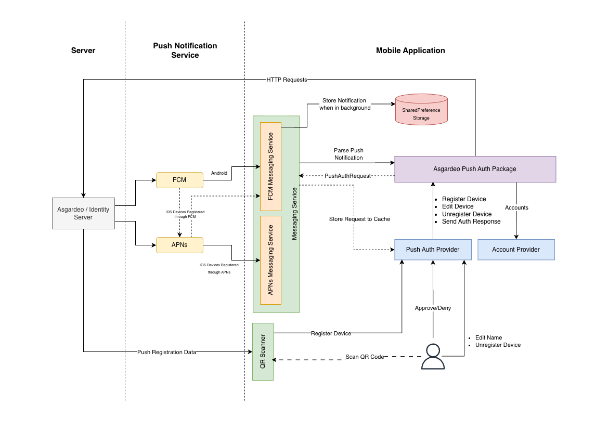

## 🏗️ Architecture



- **Cross-platform application**: A Flutter mobile application that supports push-based authentication on both iOS and Android devices.
- **Ease of use**: Users can install the Push Authenticator app on their mobile devices and use it without sign in.
- **Device registration**: Users scan a QR code to register their device for push authentication with [Asgardeo](https://wso2.com/asgardeo/) / [WSO2 Identity Server](https://is.docs.wso2.com/en/latest).
- **Push authentication SDK**: All push authentication operations — including device registration, cryptographic key management, challenge signing, auth response submission, account storage, and history tracking — are handled by the [`asgardeo_push_auth`](<PACKAGE_REPO_URL>) Flutter SDK. The app acts as the UI and notification layer on top of the SDK.
- **Push notifications**:
  - Firebase Cloud Messaging (FCM) is used to deliver push notifications to both iOS and Android devices.
  - On Android, FCM delivers notifications directly.
  - On iOS, Apple Push Notification service (APNs) is integrated with FCM to deliver notifications by default.
  - Optionally, the app can use native APNs on iOS instead of FCM (configured via `app_config.json`).

---

## State Management

The application uses [Riverpod](https://riverpod.dev/) for state management with the following provider hierarchy:

```
ProviderScope (Root)
├── AppNotifier          — Global app state and alert overlay management
├── AccountNotifier      — Account list fetched from the SDK
├── PushAuthNotifier     — In-memory cache of in-flight push auth requests
└── ThemeNotifier        — Light/dark theme mode with persistence
```

| Provider | State Type | Responsibility |
|----------|-----------|----------------|
| `AppNotifier` | `AppState` | Manages global app state and the full-screen alert overlay system (success, error, loading, info, warning, and message alerts) |
| `AccountNotifier` | `AsyncValue<List<PushAuthAccount>>` | Fetches and refreshes the registered account list from the SDK |
| `PushAuthNotifier` | `Map<String, PushAuthRequest>` | Caches in-flight push requests keyed by `pushId`; handles device registration, auth responses, and device management |
| `ThemeNotifier` | `ThemeMode` | Toggles light/dark mode and persists the preference via `SharedPreferences` |

---

## Navigation

The application uses [GoRouter](https://pub.dev/packages/go_router) for declarative routing:

| Route | Screen | Description |
|-------|--------|-------------|
| `/` | HomeScreen | Account list with search and QR scanner FAB |
| `/account/:id` | AccountDetailScreen | Account info, action menu, and push auth history |
| `/qr-scanner` | QrScannerScreen | Camera-based QR code scanning for device registration |
| `/push-auth/:pushId` | PushAuthScreen | Push auth request details with approve/deny actions |

---

## Messaging Abstraction

Push notification handling is abstracted behind a `PushMessagingService` interface, allowing the app to switch between messaging providers:

```
MessagingService (Factory)
├── FcmMessagingService    — Firebase Cloud Messaging (default for all platforms)
└── ApnsMessagingService   — Native Apple Push Notification service (optional, iOS only)
```

The messaging provider is resolved at startup based on the `feature.push.useApnsOnIos` configuration flag. The abstract interface defines:

- `requestPermission()` — Request notification permissions from the user
- `getDeviceToken()` / `refreshDeviceToken()` — Obtain and refresh the device push token
- `listenForeground()` — Listen for notifications while the app is in the foreground
- `listenBackgroundTap()` — Handle notification taps that open the app from the background
- `checkInitialMessage()` — Check if the app was launched from a notification tap
- `pickupPendingNotification()` — Retrieve stored background notification payloads

---

## Push Authentication Flow

```
1. Registration
   QR Scanner → Validate QR Data → Register Device (SDK) → Account List Updated

2. Push Notification Delivery
   Server → FCM/APNs → App Receives Notification → Parse via SDK → Cache in PushAuthNotifier → Navigate to Push Auth Screen

3. Approval / Denial
   User Approves/Denies (or selects number challenge) → Send Auth Response (SDK) → Remove from Cache → Navigate Back

4. History
   Account Detail Screen → Fetch Push Auth History (SDK) → Display History Cards
```

---

For detailed file-by-file documentation, refer to the [codebase guide](./CODE.md).
